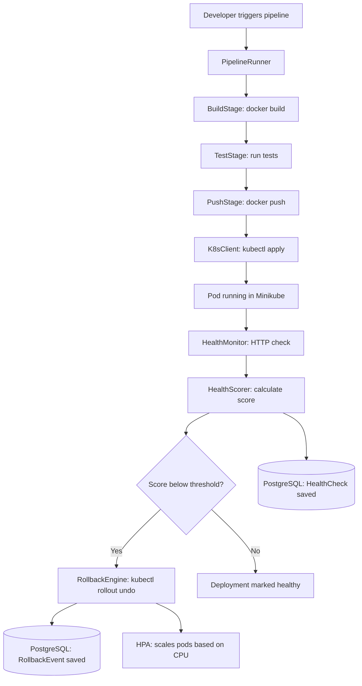

```mermaid
flowchart TD
    A[Developer triggers pipeline] --> B[PipelineRunner]
    B --> C[BuildStage: docker build]
    C --> D[TestStage: run tests]
    D --> E[PushStage: docker push]
    E --> F[K8sClient: kubectl apply]
    F --> G[Pod running in Minikube]
    G --> H[HealthMonitor: HTTP check]
    H --> I[HealthScorer: calculate score]
    I --> J{Score below threshold?}
    J -->|Yes| K[RollbackEngine: kubectl rollout undo]
    J -->|No| L[Deployment marked healthy]
    I --> M[(PostgreSQL: HealthCheck saved)]
    K --> N[(PostgreSQL: RollbackEvent saved)]
    K --> O[HPA: scales pods based on CPU]
```