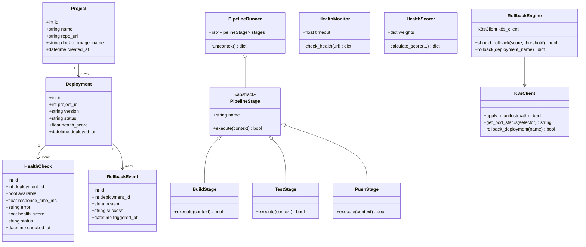

```mermaid
classDiagram
    class Project {
        +int id
        +string name
        +string repo_url
        +string docker_image_name
        +datetime created_at
    }

    class Deployment {
        +int id
        +int project_id
        +string version
        +string status
        +float health_score
        +datetime deployed_at
    }

    class HealthCheck {
        +int id
        +int deployment_id
        +bool available
        +float response_time_ms
        +string error
        +float health_score
        +string status
        +datetime checked_at
    }

    class RollbackEvent {
        +int id
        +int deployment_id
        +string reason
        +string success
        +datetime triggered_at
    }

    class PipelineStage {
        <<abstract>>
        +string name
        +execute(context) bool
    }

    class BuildStage {
        +execute(context) bool
    }

    class TestStage {
        +execute(context) bool
    }

    class PushStage {
        +execute(context) bool
    }

    class PipelineRunner {
        +list~PipelineStage~ stages
        +run(context) dict
    }

    class K8sClient {
        +apply_manifest(path) bool
        +get_pod_status(selector) string
        +rollback_deployment(name) bool
    }

    class HealthMonitor {
        +float timeout
        +check_health(url) dict
    }

    class HealthScorer {
        +dict weights
        +calculate_score(...) dict
    }

    class RollbackEngine {
        +K8sClient k8s_client
        +should_rollback(score, threshold) bool
        +rollback(deployment_name) dict
    }

    PipelineStage <|-- BuildStage
    PipelineStage <|-- TestStage
    PipelineStage <|-- PushStage
    PipelineRunner o-- PipelineStage
    RollbackEngine --> K8sClient
    Project "1" --> "many" Deployment
    Deployment "1" --> "many" HealthCheck
    Deployment "1" --> "many" RollbackEvent
```